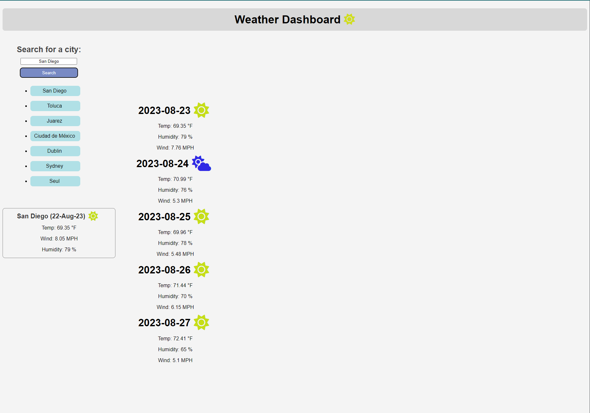

# 🌐 JWeather Forecast

## 📸 Screengrab

**JWeather Forecast** is a sleek and straightforward JavaScript application designed to provide you with accurate weather information for cities worldwide. Whether you're planning a trip or just curious about the weather in a distant city, JWeather Forecast is your go-to source for timely and accurate meteorological data.

## 🌟 Features

- **Small**: Lightweight design ensures quick loading times.
- **Compact**: Get the information you need without any clutter.
- **Efficient**: Optimized to use minimal computer resources.

## 📌 Prerequisites

- A modern web browser (like Google Chrome, Firefox, or Edge).
- An internet connection to fetch weather data.

## 🚀 Installation

1. For local use, simply download the repository and open the `index.html` file in your preferred browser.
2. Alternatively, access the deployed version directly at the [live deployed Github Page](https://le-shush.github.io/06_weatherDashboard/).

## 🖥️ Usage

1. Launch the app either locally or via the deployed link.
2. Enter the name of the city you're interested in.
3. Press 'Search' or hit Enter.
4. View the current weather details and the forecast for the upcoming days.

## 🤝 Contributing

Contributions are the backbone of open-source projects. If you're interested in enhancing JWeather Forecast:

1. Fork the Project.
2. Clone the repository to your local machine.
3. Create your Feature Branch (`git checkout -b feature/YourFeatureName`).
4. Commit your Changes (`git commit -m 'Describe your feature'`).
5. Push to the Branch (`git push origin feature/YourFeatureName`).
6. Open a Pull Request detailing the changes you've made.

## 📜 License

This project is licensed under the MIT License - see the [LICENSE.md](./LICENSE) file for details.

## 📞 Contact

👤 **le-shush**

- GitHub: [@le-shush](https://github.com/le-shush)